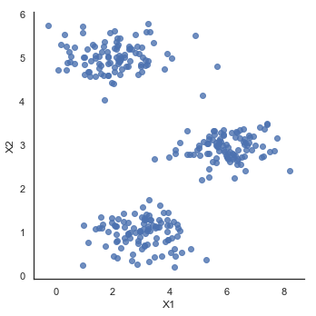
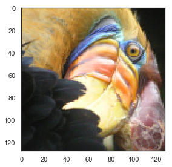
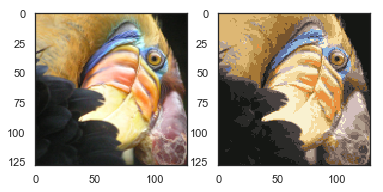
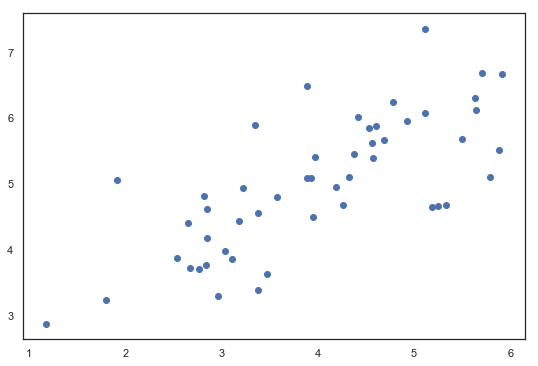
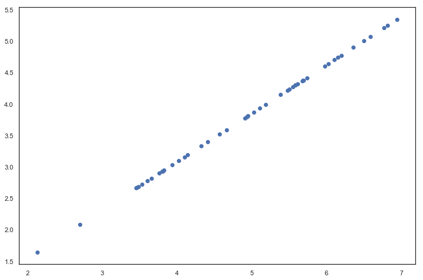
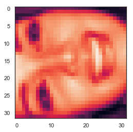
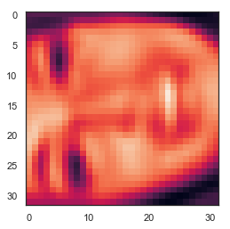

## 机器学习基础练习 7 - K-means 和PCA

### 在本次作业中，我们将进行K-means聚类和PCA降维的练习，并使用它们来压缩图像。
* 我们将从一个简单的2D数据集开始，以了解K-means是如何工作的，然后我们将其应用于图像压缩。 
* 我们还将对PCA降维进行实验，了解如何使用它来找到人脸图像的低维表示。

### 1. K-means 聚类

为了可视化方便，我们将实施和应用K-means到一个简单的二维数据集，以获得工作原理的直观理解。K-means是一个迭代的，无监督的聚类算法，将类别相近的样本组合成簇。该算法从猜测每个簇的初始聚类中心开始，然后重复将样本分配给最近的簇，并重新计算该簇的聚类中心。


```python
import numpy as np
import pandas as pd
import matplotlib.pyplot as plt
import seaborn as sb
from scipy.io import loadmat
```

我们首先要实现的是找到数据中每个实例最接近的聚类中心的函数，已为大家准备好了。


```python
def find_closest_centroids(X, centroids):
    m = X.shape[0]
    k = centroids.shape[0]
    idx = np.zeros(m)
    
    for i in range(m):
        min_dist = 1000000
        for j in range(k):
            dist = np.sum((X[i,:] - centroids[j,:]) ** 2)
            if dist < min_dist:
                min_dist = dist
                idx[i] = j
    
    return idx
```

让我们来测试这个函数，以确保它的工作正常。 我们将使用练习中提供的测试用例。


```python
data = loadmat('data/ex7data2.mat')
X = data['X']
initial_centroids = initial_centroids = np.array([[3, 3], [6, 2], [8, 5]])

idx = find_closest_centroids(X, initial_centroids)
idx[0:3]
```


    array([0., 2., 1.])


输出与文本中的预期值匹配（记住我们的数组是从0开始索引的，而不是从1开始索引）。 
接下来，我们需要一个函数来计算簇的聚类中心。聚类中心只是当前分配给簇的所有样本的平均值。


```python
data2 = pd.DataFrame(data.get('X'), columns=['X1', 'X2'])
data2.head()
```


<div>
<style scoped>
    .dataframe tbody tr th:only-of-type {
        vertical-align: middle;
    }

    .dataframe tbody tr th {
        vertical-align: top;
    }

    .dataframe thead th {
        text-align: right;
    }
</style>
<table border="1" class="dataframe">
  <thead>
    <tr style="text-align: right;">
      <th></th>
      <th>X1</th>
      <th>X2</th>
    </tr>
  </thead>
  <tbody>
    <tr>
      <th>0</th>
      <td>1.842080</td>
      <td>4.607572</td>
    </tr>
    <tr>
      <th>1</th>
      <td>5.658583</td>
      <td>4.799964</td>
    </tr>
    <tr>
      <th>2</th>
      <td>6.352579</td>
      <td>3.290854</td>
    </tr>
    <tr>
      <th>3</th>
      <td>2.904017</td>
      <td>4.612204</td>
    </tr>
    <tr>
      <th>4</th>
      <td>3.231979</td>
      <td>4.939894</td>
    </tr>
  </tbody>
</table>
</div>


```python
sb.set(context="notebook", style="white")
sb.lmplot('X1', 'X2', data=data2, fit_reg=False)
plt.show()
```





```python
def compute_centroids(X, idx, k):
    m, n = X.shape
    centroids = np.zeros((k, n))
    
    for i in range(k):
        indices = np.where(idx == i)
        centroids[i,:] = (np.sum(X[indices,:], axis=1) / len(indices[0])).ravel()
    
    return centroids
```


```python
compute_centroids(X, idx, 3)
```


    array([[2.42830111, 3.15792418],
           [5.81350331, 2.63365645],
           [7.11938687, 3.6166844 ]])


此输出也符合练习中的预期值。 
下一部分涉及实际运行该算法的一些迭代次数和可视化结果。 
这个步骤是由于并不复杂，我将从头开始构建它。 为了运行算法，我们只需要在将样本分配给最近的簇并重新计算簇的聚类中心。


```python
def run_k_means(X, initial_centroids, max_iters):
    m, n = X.shape
    k = initial_centroids.shape[0]
    idx = np.zeros(m)
    centroids = initial_centroids
    
    for i in range(max_iters):
        idx= find_closest_centroids(X, centroids)
        centroids= compute_centroids(X, idx, k)

    return idx, centroids
```


```python
idx, centroids = run_k_means(X, initial_centroids, 10)
```


```python
cluster1 = X[np.where(idx == 0)[0],:]
cluster2 = X[np.where(idx == 1)[0],:]
cluster3 = X[np.where(idx == 2)[0],:]

fig, ax = plt.subplots(figsize=(9,6))
ax.scatter(cluster1[:,0], cluster1[:,1], s=30, color='r', label='Cluster 1')
ax.scatter(cluster2[:,0], cluster2[:,1], s=30, color='g', label='Cluster 2')
ax.scatter(cluster3[:,0], cluster3[:,1], s=30, color='b', label='Cluster 3')
ax.legend()
plt.show()
```


我们跳过的一个步骤是初始化聚类中心的过程，这会影响算法的收敛效果。
接下来，让我们实现这个选择随机样本并将其用作初始聚类中心的函数。


```python
def init_centroids(X, k):
    m, n = X.shape
    centroids = np.zeros((k, n))
    idx = np.random.randint(0, m, k)
    
    for i in range(k):
        centroids[i,:]= X[idx[i],:]
    
    return centroids
```


```python
init_centroids(X, 3)
```


    array([[3.02836363, 1.35635189],
           [1.95538864, 1.32156857],
           [3.32648885, 1.28019066]])


我们的下一个任务是将K-means应用于图像压缩。 
在下面的练习中，我们可以使用聚类来找到最具代表性的少数颜色，并使用聚类分配将原始的24位颜色映射到较低维的颜色空间。 

下面是我们要压缩的图像。


```python
from IPython.display import Image
Image(filename='data/bird_small.png')
```


The raw pixel data has been pre-loaded for us so let's pull it in.


```python
image_data = loadmat('data/bird_small.mat')
image_data
```


    {'__header__': b'MATLAB 5.0 MAT-file, Platform: GLNXA64, Created on: Tue Jun  5 04:06:24 2012',
     '__version__': '1.0',
     '__globals__': [],
     'A': array([[[219, 180, 103],
             [230, 185, 116],
             [226, 186, 110],
             ...,
             [ 14,  15,  13],
             [ 13,  15,  12],
             [ 12,  14,  12]],
     
            [[230, 193, 119],
             [224, 192, 120],
             [226, 192, 124],
             ...,
             [ 16,  16,  13],
             [ 14,  15,  10],
             [ 11,  14,   9]],
     
            [[228, 191, 123],
             [228, 191, 121],
             [220, 185, 118],
             ...,
             [ 14,  16,  13],
             [ 13,  13,  11],
             [ 11,  15,  10]],
     
            ...,
     
            [[ 15,  18,  16],
             [ 18,  21,  18],
             [ 18,  19,  16],
             ...,
             [ 81,  45,  45],
             [ 70,  43,  35],
             [ 72,  51,  43]],
     
            [[ 16,  17,  17],
             [ 17,  18,  19],
             [ 20,  19,  20],
             ...,
             [ 80,  38,  40],
             [ 68,  39,  40],
             [ 59,  43,  42]],
     
            [[ 15,  19,  19],
             [ 20,  20,  18],
             [ 18,  19,  17],
             ...,
             [ 65,  43,  39],
             [ 58,  37,  38],
             [ 52,  39,  34]]], dtype=uint8)}


```python
A = image_data['A']
A.shape
```


    (128, 128, 3)


现在我们需要对数据应用一些预处理，并将其提供给K-means算法。


```python
# normalize value ranges
A = A / 255.

# reshape the array
X = np.reshape(A, (A.shape[0] * A.shape[1], A.shape[2]))
X.shape
```


    (16384, 3)


```python
# randomly initialize the centroids
initial_centroids = init_centroids(X, 16)

# run the algorithm
idx, centroids = run_k_means(X, initial_centroids, 10)

# get the closest centroids one last time
idx = find_closest_centroids(X, centroids)

# map each pixel to the centroid value
X_recovered = centroids[idx.astype(int),:]
X_recovered.shape
```


    (16384, 3)


```python
# reshape to the original dimensions
X_recovered = np.reshape(X_recovered, (A.shape[0], A.shape[1], A.shape[2]))
X_recovered.shape
```


    (128, 128, 3)


```python
plt.imshow(X_recovered)
plt.show()
```


您可以看到我们对图像进行了压缩，但图像的主要特征仍然存在。这就是K-means。

下面我们来用scikit-learn来实现K-means。


```python
from skimage import io

# cast to float, you need to do this otherwise the color would be weird after clustring
pic = io.imread('data/bird_small.png') / 255.
io.imshow(pic)
plt.show()
```





```python
pic.shape
```


    (128, 128, 3)


```python
# serialize data
data = pic.reshape(128*128, 3)
```


```python
data.shape
```


    (16384, 3)


```python
from sklearn.cluster import KMeans #导入K-Means库

model = KMeans(n_clusters=16, n_init=100, n_jobs=-1)
```


```python
model.fit(data)
```


    KMeans(algorithm='auto', copy_x=True, init='k-means++', max_iter=300,
        n_clusters=16, n_init=100, n_jobs=-1, precompute_distances='auto',
        random_state=None, tol=0.0001, verbose=0)


```python
centroids = model.cluster_centers_
print(centroids.shape)

C = model.predict(data)
print(C.shape)
```

    (16, 3)
    (16384,)
    


```python
centroids[C].shape
```


    (16384, 3)


```python
compressed_pic = centroids[C].reshape((128,128,3))
```


```python
fig, ax = plt.subplots(1, 2)
ax[0].imshow(pic)
ax[1].imshow(compressed_pic)
plt.show()
```





### 2. Principal component analysis（主成分分析）

PCA是在数据集中找到“主成分”或最大方差方向的线性变换。 它可以用于降维。
在本练习中，我们将实现PCA应用于一个简单的二维数据集，以了解它是如何工作的。
我们从首先加载和可视化数据集开始。


```python
data = loadmat('data/ex7data1.mat')
data
```


    {'__header__': b'MATLAB 5.0 MAT-file, Platform: PCWIN64, Created on: Mon Nov 14 22:41:44 2011',
     '__version__': '1.0',
     '__globals__': [],
     'X': array([[3.38156267, 3.38911268],
            [4.52787538, 5.8541781 ],
            [2.65568187, 4.41199472],
            [2.76523467, 3.71541365],
            [2.84656011, 4.17550645],
            [3.89067196, 6.48838087],
            [3.47580524, 3.63284876],
            [5.91129845, 6.68076853],
            [3.92889397, 5.09844661],
            [4.56183537, 5.62329929],
            [4.57407171, 5.39765069],
            [4.37173356, 5.46116549],
            [4.19169388, 4.95469359],
            [5.24408518, 4.66148767],
            [2.8358402 , 3.76801716],
            [5.63526969, 6.31211438],
            [4.68632968, 5.6652411 ],
            [2.85051337, 4.62645627],
            [5.1101573 , 7.36319662],
            [5.18256377, 4.64650909],
            [5.70732809, 6.68103995],
            [3.57968458, 4.80278074],
            [5.63937773, 6.12043594],
            [4.26346851, 4.68942896],
            [2.53651693, 3.88449078],
            [3.22382902, 4.94255585],
            [4.92948801, 5.95501971],
            [5.79295774, 5.10839305],
            [2.81684824, 4.81895769],
            [3.88882414, 5.10036564],
            [3.34323419, 5.89301345],
            [5.87973414, 5.52141664],
            [3.10391912, 3.85710242],
            [5.33150572, 4.68074235],
            [3.37542687, 4.56537852],
            [4.77667888, 6.25435039],
            [2.6757463 , 3.73096988],
            [5.50027665, 5.67948113],
            [1.79709714, 3.24753885],
            [4.3225147 , 5.11110472],
            [4.42100445, 6.02563978],
            [3.17929886, 4.43686032],
            [3.03354125, 3.97879278],
            [4.6093482 , 5.879792  ],
            [2.96378859, 3.30024835],
            [3.97176248, 5.40773735],
            [1.18023321, 2.87869409],
            [1.91895045, 5.07107848],
            [3.95524687, 4.5053271 ],
            [5.11795499, 6.08507386]])}


```python
X = data['X']

fig, ax = plt.subplots(figsize=(9,6))
ax.scatter(X[:, 0], X[:, 1])
plt.show()
```





PCA的算法相当简单。 在确保数据被归一化之后，输出仅仅是原始数据的协方差矩阵的奇异值分解。
请实现PCA算法。


```python
def pca(X):
    # normalize the features 归一化
    X = (X - X.mean()) / X.std()
    
    # compute the covariance matrix
    X = np.matrix(X)
    cov = (X.T * X) / X.shape[0]
    
    # perform SVD
    U, S, V = np.linalg.svd(cov)
    
    return U, S, V
```


```python
U, S, V = pca(X)
U, S, V
```


    (matrix([[-0.79241747, -0.60997914],
             [-0.60997914,  0.79241747]]),
     array([1.43584536, 0.56415464]),
     matrix([[-0.79241747, -0.60997914],
             [-0.60997914,  0.79241747]]))


现在我们有主成分（矩阵U），我们可以用这些来将原始数据投影到一个较低维的空间中。
对于这个任务，我们将实现一个投影函数，仅选择顶部k个分量，从而有效地减少了维数。


```python
def project_data(X, U, k):
    U_reduced = U[:,:k]
    return np.dot(X, U_reduced)
```


```python
Z = project_data(X, U, 1)
Z
```


    matrix([[-4.74689738],
            [-7.15889408],
            [-4.79563345],
            [-4.45754509],
            [-4.80263579],
            [-7.04081342],
            [-4.97025076],
            [-8.75934561],
            [-6.2232703 ],
            [-7.04497331],
            [-6.91702866],
            [-6.79543508],
            [-6.3438312 ],
            [-6.99891495],
            [-4.54558119],
            [-8.31574426],
            [-7.16920841],
            [-5.08083842],
            [-8.54077427],
            [-6.94102769],
            [-8.5978815 ],
            [-5.76620067],
            [-8.2020797 ],
            [-6.23890078],
            [-4.37943868],
            [-5.56947441],
            [-7.53865023],
            [-7.70645413],
            [-5.17158343],
            [-6.19268884],
            [-6.24385246],
            [-8.02715303],
            [-4.81235176],
            [-7.07993347],
            [-5.45953289],
            [-7.60014707],
            [-4.39612191],
            [-7.82288033],
            [-3.40498213],
            [-6.54290343],
            [-7.17879573],
            [-5.22572421],
            [-4.83081168],
            [-7.23907851],
            [-4.36164051],
            [-6.44590096],
            [-2.69118076],
            [-4.61386195],
            [-5.88236227],
            [-7.76732508]])


我们也可以通过反向转换步骤来恢复原始数据，请实现这个函数。


```python
def recover_data(Z, U, k):
    U_reduced = U[:,:k]
    
    return Z @ U_reduced.T
```


```python
X_recovered = recover_data(Z, U, 1)
X_recovered
```


    matrix([[3.76152442, 2.89550838],
            [5.67283275, 4.36677606],
            [3.80014373, 2.92523637],
            [3.53223661, 2.71900952],
            [3.80569251, 2.92950765],
            [5.57926356, 4.29474931],
            [3.93851354, 3.03174929],
            [6.94105849, 5.3430181 ],
            [4.93142811, 3.79606507],
            [5.58255993, 4.29728676],
            [5.48117436, 4.21924319],
            [5.38482148, 4.14507365],
            [5.02696267, 3.8696047 ],
            [5.54606249, 4.26919213],
            [3.60199795, 2.77270971],
            [6.58954104, 5.07243054],
            [5.681006  , 4.37306758],
            [4.02614513, 3.09920545],
            [6.76785875, 5.20969415],
            [5.50019161, 4.2338821 ],
            [6.81311151, 5.24452836],
            [4.56923815, 3.51726213],
            [6.49947125, 5.00309752],
            [4.94381398, 3.80559934],
            [3.47034372, 2.67136624],
            [4.41334883, 3.39726321],
            [5.97375815, 4.59841938],
            [6.10672889, 4.70077626],
            [4.09805306, 3.15455801],
            [4.90719483, 3.77741101],
            [4.94773778, 3.80861976],
            [6.36085631, 4.8963959 ],
            [3.81339161, 2.93543419],
            [5.61026298, 4.31861173],
            [4.32622924, 3.33020118],
            [6.02248932, 4.63593118],
            [3.48356381, 2.68154267],
            [6.19898705, 4.77179382],
            [2.69816733, 2.07696807],
            [5.18471099, 3.99103461],
            [5.68860316, 4.37891565],
            [4.14095516, 3.18758276],
            [3.82801958, 2.94669436],
            [5.73637229, 4.41568689],
            [3.45624014, 2.66050973],
            [5.10784454, 3.93186513],
            [2.13253865, 1.64156413],
            [3.65610482, 2.81435955],
            [4.66128664, 3.58811828],
            [6.1549641 , 4.73790627]])


```python
fig, ax = plt.subplots(figsize=(12,8))
ax.scatter(list(X_recovered[:, 0]), list(X_recovered[:, 1]))
plt.show()
```





我们看到，第一主成分的投影轴基本上是数据集中的对角线。当我们将数据减少到仅有一个维度时，我们失去了该对角线周围的变化，所以在我们的恢复数据中，一切都沿着该对角线。

我们在此练习中的最后一个任务是将PCA应用于人脸图像。通过使用相同的降维技术，我们可以使用比原始图像少得多的数据来捕获图像的“本质”。


```python
faces = loadmat('data/ex7faces.mat')
X = faces['X']
X.shape
```


    (5000, 1024)


```python
def plot_n_image(X, n):
    """ plot first n images
    n has to be a square number
    """
    pic_size = int(np.sqrt(X.shape[1]))
    grid_size = int(np.sqrt(n))

    first_n_images = X[:n, :]

    fig, ax_array = plt.subplots(nrows=grid_size, ncols=grid_size,
                                    sharey=True, sharex=True, figsize=(8, 8))

    for r in range(grid_size):
        for c in range(grid_size):
            ax_array[r, c].imshow(first_n_images[grid_size * r + c].reshape((pic_size, pic_size)))
            plt.xticks(np.array([]))
            plt.yticks(np.array([]))

```

上述函数用来显示前n张人脸图像，你可以使用这个函数查看一下都有哪些人脸图像，选择一个你喜欢的进行接下来的练习，:)
有条件的同学可以尝试替换成自己的大头照进行下面的测试。


```python
face = np.reshape(X[30,:], (32, 32))
```


```python
plt.imshow(face)
plt.show()
```





看起来很糟糕，马赛克效果比较明显吧。这些是只有32 x 32灰度的图像。
我们的下一步是在面数据集上运行PCA，并取得前100个主要特征。


```python
U, S, V = pca(X)
Z = project_data(X, U, 100)
```

现在我们可以尝试恢复原来的结构并再次渲染。


```python
X_recovered = recover_data(Z, U, 100)
face = np.reshape(X_recovered[30,:], (32, 32))
plt.imshow(face)
plt.show()
```





请注意，我们失去了一些细节，尽管没有像您预期的维度数量减少10倍，但总得显示效果还不错。
