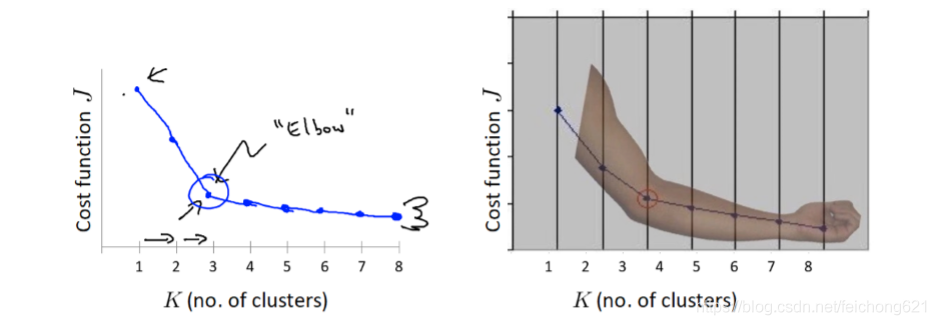
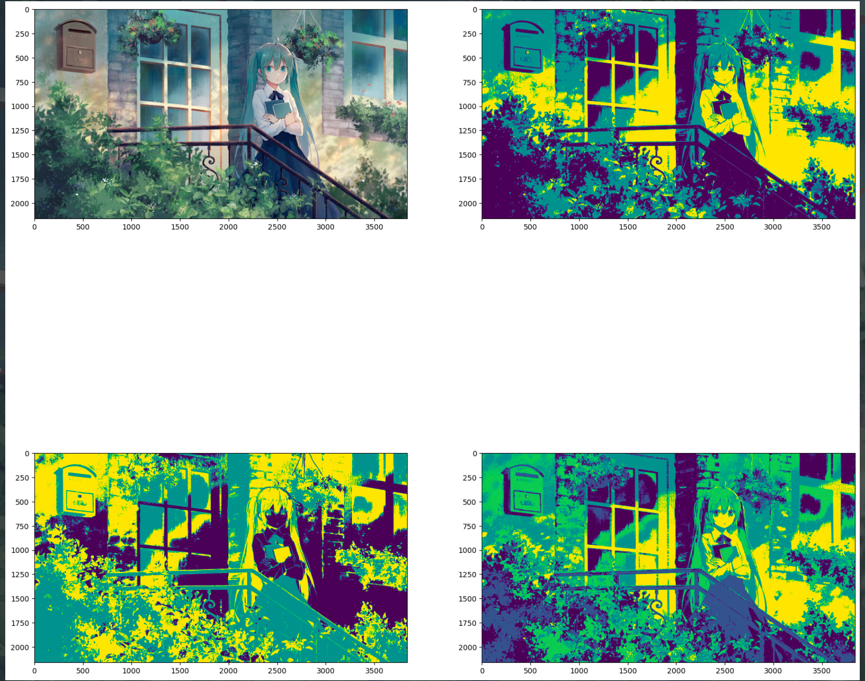

# Kmeans 实验报告

## 201250182 郑义

## 算法原理

Kmeans 算法是一种无监督的聚类算法，通过不断的迭代找到数据之间共有的特征从而数据进行分类。在 Kmeans 中，数据之间的共有特征被定义为距离某个「聚类中心」最近，则归属于该类别当中。

Kmeans 算法的基本流程如下：

1. 确定一个类别数量 k
2. 初始化 k 个聚类中心（可以采用随机初始化的方式）
3. 对于每一个训练数据的样本点，都计算样本点到每个聚类中心的距离，将该样本点归属到距离它最近的聚类中心的类别当中
4. 重新计算每一个类别的聚类中心，新的聚类中心定义为在该类当中所有样本点的均值
5. 如果达到了停止条件（什么是停止的条件），则退出，否则重复迭代。

在 Kmeans 当中，比较难以确定的两个因素为：

1. 在训练的时候究竟应该选择多少类别？类别过多可能会造成模型对训练数据的过拟合，过少则可能欠拟合。
2. 在训练过程中什么时候能够停止迭代？

上述的两个问题是 Kmeans 中比较经典的问题，对于如何确定这几个参数我找了一部分资料，有如下的解决办法：

1. 对于类别的选择，可以采用 **肘部法则** 来确定 k 的值究竟应该为多少。如下图所示，当 k 值增加到一定程度的时候，再增加 k 值并不能够很好的减少损失函数的值，这个时候增加 k 值并不会有效的增加我们模型的准确率，反而会降低模型的泛化程度，导致模型过拟合。
2. 在训练过程中，我通过两种方式来让训练停止迭代：
   1. 通过定义损失函数（loss function）和最小的损失函数阈值来停止迭代，即当某一个迭代回合中，损失函数的值小于预先确定的阈值，这个时候就认为模型满足了要求，可以停止迭代。
   2. 通过定义最大迭代次数来强制停止迭代。
   3. 实际上也可以通过查看每一个类是否在迭代过程中有变化来定义停止条件（实验中这个和第一个等价，因为损失函数定义了聚类中心的变化欧拉距离之和，如果一个类没有变化，那么损失函数就为 0）。



## 代码解释

用的是 `jupyter notebook` 来编写代码，方便过程的展示。

```python
def distance_diff(cur_centroids: list, prev_centroids: list) -> np.ndarray:
    """
    计算当前聚类中心和上一次聚类中心的欧拉距离之和（即像素点坐标差的平方和）

    :param cur_centroids: 当前的聚类中心
    :param prev_centroids: 上一次的聚类中心
    :return:
    """
    cur_centroids = np.array(cur_centroids)
    prev_centroids = np.array(prev_centroids)

    return np.sum((cur_centroids - prev_centroids) ** 2)
```

这段代码其实就是定义了损失函数，是新的聚类中心和旧的聚类中心的欧拉距离和，用来作为判断程序是否需要停止迭代的条件

```python
def classifier(data: np.ndarray, centroids: np.ndarray) -> np.ndarray:
    """
    分类器，通过像素点 matrix 和聚类中心给所有像素点分类（即打上标签）

    :param data: 输入数据（在这里指图像的像素 matrix）
    :param centroids: 聚类中心
    :return: 标签矩阵，size 和 data 的 size 相同
    """
    row_count, col_count = data.shape
    # 用来存储所有像素的标签
    pixels_labels = np.zeros((row_count, col_count))
    pixel_distance = []

    for i in range(row_count):
        for j in range(col_count):
            # 计算像素点与每个 centroid 的欧拉距离
            for k in range(len(centroids)):
                distance = np.sum(abs((data[i, j]).astype(int) - centroids[k].astype(int)) ** 2)
                pixel_distance.append(distance)
            # 找到距离最小的 centroid，该像素点就是该类
            pixels_labels[i, j] = int(pixel_distance.index(min(pixel_distance)))
            pixel_distance = []

    return pixels_labels
```

分类器，用来将每一个样本点打上对应的类别标签。通过计算与聚类中心的距离找到最小距离的聚类中心，打上标签。

```python
def kmeans(data: np.ndarray, cluster_num: int, max_iter: int, min_loss: int = 1) -> np.ndarray:
    """

    :param data: 输入数据，即图像的像素点矩阵
    :param cluster_num: 类别数量
    :param max_iter: 最大的迭代次数，作为判断是否停止迭代的一个条件
    :param min_loss: 最小的损失函数的值，作为判断是否停止迭代的一个条件
    :return: 分类后的图像标签矩阵
    """
    data_copy = np.copy(data)
    print("data shape: " + str(data_copy.shape))
    input_row, input_col = data_copy.shape
    pixels_labels = np.zeros((input_row, input_col))

    # 随机初始聚类中心
    initial_centroid_row_num = [i for i in range(input_row)]
    random.shuffle(initial_centroid_row_num)
    initial_centroid_row_num = initial_centroid_row_num[:cluster_num]

    initial_centroid_col_num = [i for i in range(input_col)]
    random.shuffle(initial_centroid_col_num)
    initial_centroid_col_num = initial_centroid_col_num[:cluster_num]

    # 当前的聚类中心
    cur_centroids = []
    for i in range(cluster_num):
        cur_centroids.append(data_copy[initial_centroid_row_num[i], initial_centroid_col_num[i]])

    pixels_labels = classifier(data_copy, cur_centroids)

    iter_count = 0  # 用于记录迭代次数
    while True:
        prev_centroids = cur_centroids.copy()  # 储存前一次的聚类中心
        # 计算当前聚类中心
        for n in range(cluster_num):
            temp = np.where(pixels_labels == n)
            cur_centroids[n] = sum(data_copy[temp].astype(int)) / len(data_copy[temp])

        # 根据当前聚类中心分类
        pixels_labels = classifier(data_copy, cur_centroids)
        # 计算上一次聚类中心与当前聚类中心的差异
        loss = distance_diff(cur_centroids, prev_centroids)
        iter_count += 1
        print("Step:" + str(iter_count) + "  Loss:" + str(loss))
        # 当损失小于迭代阈值时，结束迭代
        if iter_count >= max_iter or loss < min_loss:
            break

    return pixels_labels
```

Kmeans 主函数，实际上执行的就是上述提到的算法步骤。

## 可视化结果

## 探究

探究了以下几种情况和 k 的选值

| 图片         | k 值 | 最大迭代次数 | 损失函数阈值 |
| ------------ | ---- |--------|--------|
| 灰度图       | 3    | 20     | 1      |
| 灰度图 | 3    | 20     | 0.5    |
| 灰度图 | 5    | 20     | 1      |

基本不需要迭代 20 次就可以达到预定的阈值。探究了相同 k 值不同损失函数阈值和相同损失函数阈值不同 k 值的情况，结果如下：



## 算法改进措施

可以通过 Kmeans++ 来改进该算法
