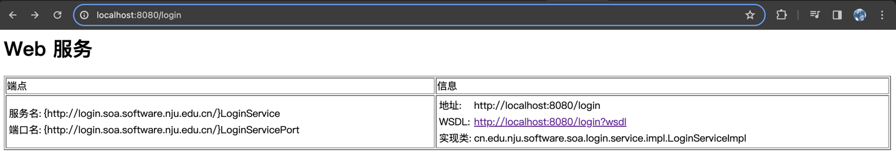
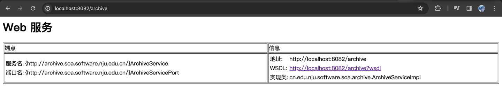
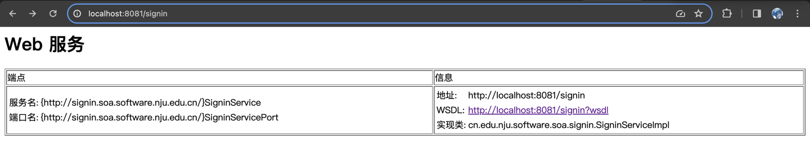
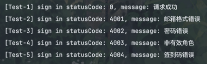
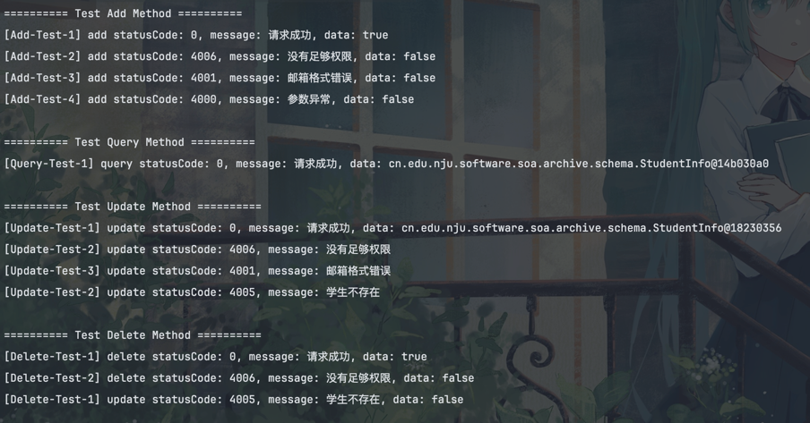

# 面向服务的软件工程 assignment two

## 201250182 郑义

### 邮箱登陆功能

start from java 来实现邮箱登陆功能，首先定义 `LoginService`

```java
@WebService(name = "LoginService", serviceName = "LoginService", targetNamespace = "http://login.soa.software.nju.edu.cn/")
@SOAPBinding(parameterStyle = SOAPBinding.ParameterStyle.BARE)
public interface LoginService {

    /**
     * 邮箱登陆
     *
     * <p>验证邮箱身份 并 返回对应的身份信息</p>
     *
     * @param loginRequest 登陆请求
     * @return 登陆响应
     */
    @WebMethod
    LoginResponse login(LoginRequest loginRequest);
}
```

然后对邮箱登陆功能进行对应的实现，可能的错误情况有：

1. 邮箱格式错误
2. 角色错误（即无法识别邮箱后缀）
3. 密码错误

基于上述的错误情况，实现对应的登陆功能如下（代码在 login-service 下）：

```java
/**
 * Login service implementation
 */
@WebService(name = "LoginService", serviceName = "LoginService", targetNamespace = "http://login.soa.software.nju.edu.cn/")
public class LoginServiceImpl implements LoginService {

    private static final int UNDERGRADUATE_PREFIX_LENGTH = 9;
    private static final String TEACHER_POSTFIX = "nju.edu.cn";
    private static final String STUDENT_POSTFIX = "smail.nju.edu.cn";

    /**
     * mock data to test
     */
    private static final Map<String, String> MOCK_DATA = Map.of(
            // undergraduate email
            "201250182@smail.nju.edu.cn", "123456",
            // graduate email
            "522022320130@smail.nju.edu.cn", "123456",
            // teacher email
            "test@nju.edu.cn", "123456"
    );

    @Override
    public LoginResponse login(LoginRequest loginRequest) {
        // check whether parameter is null
        if (loginRequest == null) {
            return new LoginResponse(StatusCode.BAD_PARAMETER);
        }
        String email = loginRequest.getEmail();
        String password = loginRequest.getPassword();

        // verify email
        boolean isVerifiedEmail = verifyEmail(email);
        if (!isVerifiedEmail) {
            return new LoginResponse(StatusCode.INVALID_EMAIL);
        }

        // verify role of email
        Role role = getRoleFromEmail(email);
        if (role == null) {
            return new LoginResponse(StatusCode.INVALID_ROLE);
        }

        // verify password
        boolean isCorrectPassword = verifyPassword(email, password);
        if (!isCorrectPassword) {
            return new LoginResponse(StatusCode.INCORRECT_PASSWORD);
        }

        return new LoginResponse(StatusCode.SUCCESS, role);
    }

    private boolean verifyEmail(String email) {
        return email != null &&
                // email contains @
                email.contains("@") &&
                // @ is not the first element of email
                email.indexOf("@") != 0 &&
                // @ is not the last element of email
                email.indexOf("@") != email.length() - 1;
    }

    private boolean verifyPassword(String email, String password) {
        String correctPassword = MOCK_DATA.get(email);
        return correctPassword != null && correctPassword.equals(password);
    }

    private Role getRoleFromEmail(String email) {
        String prefix = email.split("@")[0];
        String postfix = email.split("@")[1];

        if (TEACHER_POSTFIX.equals(postfix)) {
            return Role.TEACHER;
        } else if (STUDENT_POSTFIX.equals(postfix)) {
            return prefix.length() == UNDERGRADUATE_PREFIX_LENGTH ?
                    Role.UNDERGRADUATE : Role.GRADUATE;
        }

        return null;
    }
}
```

然后实现对应的启动类将其发布到 `http://localhost:8080/login` 上:

```java
public class LoginServiceApplication {

    private static final String SERVICE_URL = "http://localhost:8080/login";

    public static void main(String[] args) {
        LoginService loginService = new LoginServiceImpl();
        Endpoint.publish(SERVICE_URL, loginService);
    }
}
```

启动程序即可看到对应的界面：



### 档案管理功能

start from wsdl 来实现档案管理（对于学生信息的增删改查），定义对应的 schema 如下：

> 对应的代码在 archive-service 下，schema 和 wsdl 在 src/main/resources 目录下

```xml
<?xml version="1.0" encoding="UTF-8" ?>
<xs:schema xmlns="http://www.w3.org/2001/XMLSchema" xmlns:xs="http://www.w3.org/2001/XMLSchema"
           targetNamespace="http://archive.soa.software.nju.edu.cn/schema/"
           xmlns:tns="http://archive.soa.software.nju.edu.cn/schema/">

    <!-- 查询请求，查询自己的信息 -->
    <xs:complexType name="QueryRequest">
        <xs:sequence>
            <xs:element name="email" type="xs:string"/>
            <xs:element name="password" type="xs:string"/>
        </xs:sequence>
    </xs:complexType>

    <!-- 查询响应 -->
    <xs:complexType name="QueryResponse">
        <xs:sequence>
            <xs:element name="code" type="xs:integer"/>
            <xs:element name="message" type="xs:string"/>
            <xs:element name="data" type="tns:StudentInfo"/>
        </xs:sequence>
    </xs:complexType>

    <!-- 添加请求，只能够教师使用 -->
    <xs:complexType name="AddRequest">
        <xs:sequence>
            <xs:element name="loginInfo" type="tns:LoginInfo"/>
            <xs:element name="name" type="xs:string"/>
            <xs:element name="id" type="xs:string"/>
            <xs:element name="email" type="xs:string"/>
            <xs:element name="gender" type="tns:Gender"/>
            <xs:element name="password" type="xs:string"/>
        </xs:sequence>
    </xs:complexType>

    <!-- 添加响应 -->
    <xs:complexType name="AddResponse">
        <xs:sequence>
            <xs:element name="code" type="xs:integer"/>
            <xs:element name="message" type="xs:string"/>
            <xs:element name="data" type="xs:boolean"/>
        </xs:sequence>
    </xs:complexType>

    <!-- 更新请求 -->
    <xs:complexType name="UpdateRequest">
        <xs:sequence>
            <xs:element name="loginInfo" type="tns:LoginInfo"/>
            <xs:element name="name" type="xs:string"/>
            <xs:element name="id" type="xs:string"/>
            <xs:element name="email" type="xs:string"/>
            <xs:element name="gender" type="tns:Gender"/>
            <xs:element name="password" type="xs:string"/>
        </xs:sequence>
    </xs:complexType>

    <xs:complexType name="UpdateResponse">
        <xs:sequence>
            <xs:element name="code" type="xs:integer"/>
            <xs:element name="message" type="xs:string"/>
            <xs:element name="data" type="tns:StudentInfo"/>
        </xs:sequence>
    </xs:complexType>

    <xs:complexType name="DeleteRequest">
        <xs:sequence>
            <xs:element name="loginInfo" type="tns:LoginInfo"/>
            <xs:element name="id" type="xs:string"/>
        </xs:sequence>
    </xs:complexType>

    <xs:complexType name="DeleteResponse">
        <xs:sequence>
            <xs:element name="code" type="xs:integer"/>
            <xs:element name="message" type="xs:string"/>
            <xs:element name="data" type="xs:boolean"/>
        </xs:sequence>
    </xs:complexType>

    <xs:complexType name="StudentInfo">
        <xs:sequence>
            <xs:element name="name" type="xs:string"/>
            <xs:element name="id" type="xs:string"/>
            <xs:element name="email" type="xs:string"/>
            <xs:element name="gender" type="tns:Gender"/>
        </xs:sequence>
    </xs:complexType>

    <xs:complexType name="LoginInfo">
        <xs:sequence>
            <xs:element name="email" type="xs:string"/>
            <xs:element name="password" type="xs:string"/>
        </xs:sequence>
    </xs:complexType>

    <xs:simpleType name="Gender">
        <xs:restriction base="xs:string">
            <xs:enumeration value="male"/>
            <xs:enumeration value="female"/>
        </xs:restriction>
    </xs:simpleType>

</xs:schema>
```

wsdl 定义如下:

```xml
<?xml version="1.0" encoding="UTF-8" ?>
<definitions
        xmlns:wsam="http://www.w3.org/2007/05/addressing/metadata"
        xmlns:soap="http://schemas.xmlsoap.org/wsdl/soap/"
        xmlns:tns="http://archive.soa.software.nju.edu.cn/"
        xmlns="http://schemas.xmlsoap.org/wsdl/"
        xmlns:ns1="http://archive.soa.software.nju.edu.cn/schema/"
        targetNamespace="http://archive.soa.software.nju.edu.cn/"
        name="ArchiveService">

    <types>
        <xs:schema xmlns:xs="http://www.w3.org/2001/XMLSchema">
            <xs:import namespace="http://archive.soa.software.nju.edu.cn/schema/" schemaLocation="ArchiveService.xsd"/>
        </xs:schema>
    </types>

    <message name="queryRequest">
        <part name="queryRequest" type="ns1:QueryRequest"/>
    </message>

    <message name="queryResponse">
        <part name="parameters" type="ns1:QueryResponse"/>
    </message>

    <message name="addRequest">
        <part name="addRequest" type="ns1:AddRequest"/>
    </message>

    <message name="addResponse">
        <part name="parameters" type="ns1:AddResponse"/>
    </message>

    <message name="updateRequest">
        <part name="updateRequest" type="ns1:UpdateRequest"/>
    </message>

    <message name="updateResponse">
        <part name="parameters" type="ns1:UpdateResponse"/>
    </message>

    <message name="deleteRequest">
        <part name="deleteRequest" type="ns1:DeleteRequest"/>
    </message>

    <message name="deleteResponse">
        <part name="parameters" type="ns1:DeleteResponse"/>
    </message>

    <portType name="ArchiveService">
        <operation name="query">
            <input wsam:Action="http://archive.soa.software.nju.edu.cn/ArchiveService/queryRequest"
                   message="tns:queryRequest"/>
            <output wsam:Action="http://archive.soa.software.nju.edu.cn/ArchiveService/queryResponse"
                    message="tns:queryResponse"/>
        </operation>

        <operation name="add">
            <input wsam:Action="http://archive.soa.software.nju.edu.cn/ArchiveService/addRequest"
                   message="tns:addRequest"/>
            <output wsam:Action="http://archive.soa.software.nju.edu.cn/ArchiveService/addResponse"
                    message="tns:addResponse"/>
        </operation>

        <operation name="update">
            <input wsam:Action="http://archive.soa.software.nju.edu.cn/ArchiveService/updateRequest"
                   message="tns:updateRequest"/>
            <output wsam:Action="http://archive.soa.software.nju.edu.cn/ArchiveService/updateResponse"
                    message="tns:updateResponse"/>
        </operation>

        <operation name="delete">
            <input wsam:Action="http://archive.soa.software.nju.edu.cn/ArchiveService/deleteRequest"
                   message="tns:deleteRequest"/>
            <output wsam:Action="http://archive.soa.software.nju.edu.cn/ArchiveService/deleteResponse"
                    message="tns:deleteResponse"/>
        </operation>
    </portType>

    <binding name="ArchiveServicePortBinding" type="tns:ArchiveService">
        <soap:binding transport="http://schemas.xmlsoap.org/soap/http" style="document"/>

        <operation name="query">
            <soap:operation soapAction=""/>
            <input>
                <soap:body use="literal"/>
            </input>
            <output>
                <soap:body use="literal"/>
            </output>
        </operation>

        <operation name="add">
            <soap:operation soapAction=""/>
            <input>
                <soap:body use="literal"/>
            </input>
            <output>
                <soap:body use="literal"/>
            </output>
        </operation>

        <operation name="update">
            <soap:operation soapAction=""/>
            <input>
                <soap:body use="literal"/>
            </input>
            <output>
                <soap:body use="literal"/>
            </output>
        </operation>

        <operation name="delete">
            <soap:operation soapAction=""/>
            <input>
                <soap:body use="literal"/>
            </input>
            <output>
                <soap:body use="literal"/>
            </output>
        </operation>

    </binding>

    <service name="ArchiveService">
        <port name="ArchiveServicePort" binding="tns:ArchiveServicePortBinding">
            <soap:address location="http://localhost:8082/archive"/>
        </port>
    </service>

</definitions>
```

然后使用 `apache-cxf` 的 `wsdl2java` 工具来将其生成为 java 代码，之后实现其中的 `ArchiveService` 接口，代码在 `archive-service/src/main/java/cn/edu/nju/software/soa/archive/ArchiveServiceImpl.java` 中

最后在 `http://localhost:8082/archive` 发布，结果如下：



### 上课签到功能

schema 定义如下：

```xml
<?xml version="1.0" encoding="UTF-8" ?>
<xs:schema xmlns="http://www.w3.org/2001/XMLSchema" xmlns:xs="http://www.w3.org/2001/XMLSchema"
        targetNamespace="http://signin.soa.software.nju.edu.cn/schema/"
        xmlns:tns="http://signin.soa.software.nju.edu.cn/schema/">

    <!-- 签到请求，包括学生邮箱和学生的密码 以及 签到码 -->
    <xs:complexType name="SigninRequest">
        <xs:sequence>
            <xs:element name="email" type="xs:string"/>
            <xs:element name="password" type="xs:string"/>
            <xs:element name="signinCode" type="xs:string"/>
        </xs:sequence>
    </xs:complexType>

    <!-- 签到响应，包括响应码，响应信息和签到状态 -->
    <xs:complexType name="SigninResponse">
        <xs:sequence>
            <xs:element name="code" type="xs:integer"/>
            <xs:element name="message" type="xs:string"/>
            <xs:element name="status" type="tns:Status" minOccurs="0"/>
        </xs:sequence>
    </xs:complexType>

    <xs:simpleType name="Status">
        <xs:restriction base="xs:string">
            <xs:enumeration value="onTime"/>
            <xs:enumeration value="late"/>
            <xs:enumeration value="absent"/>
        </xs:restriction>
    </xs:simpleType>

</xs:schema>
```

wsdl 定义如下：

```xml
<?xml version="1.0" encoding="UTF-8" ?>
<definitions
        xmlns:wsam="http://www.w3.org/2007/05/addressing/metadata"
        xmlns:soap="http://schemas.xmlsoap.org/wsdl/soap/"
        xmlns:tns="http://signin.soa.software.nju.edu.cn/"
        xmlns="http://schemas.xmlsoap.org/wsdl/"
        xmlns:ns1="http://signin.soa.software.nju.edu.cn/schema/"
        targetNamespace="http://signin.soa.software.nju.edu.cn/"
        name="SigninService">

    <types>
        <xs:schema xmlns:xs="http://www.w3.org/2001/XMLSchema">
            <xs:import namespace="http://signin.soa.software.nju.edu.cn/schema/" schemaLocation="SigninService.xsd"/>
        </xs:schema>
    </types>

    <message name="signin">
        <part name="parameters" type="ns1:SigninRequest"/>
    </message>

    <message name="signinResponse">
        <part name="parameters" type="ns1:SigninResponse"/>
    </message>

    <portType name="SigninService">
        <operation name="signin">
            <input wsam:Action="http://signin.soa.software.nju.edu.cn/SigninService/signinRequest" message="tns:signin"/>
            <output wsam:Action="http://signin.soa.software.nju.edu.cn/SigninService/signinResponse" message="tns:signinResponse"/>
        </operation>
    </portType>

    <binding name="SigninServicePortBinding" type="tns:SigninService">
        <soap:binding transport="http://schemas.xmlsoap.org/soap/http" style="document"/>
        <operation name="signin">
            <soap:operation soapAction=""/>
            <input>
                <soap:body use="literal"/>
            </input>
            <output>
                <soap:body use="literal"/>
            </output>
        </operation>
    </binding>

    <service name="SigninService">
        <port name="SigninServicePort" binding="tns:SigninServicePortBinding">
            <soap:address location="http://localhost:8081/signin"/>
        </port>
    </service>

</definitions>
```

然后使用 `apache-cxf` 的 `wsdl2java` 工具来将其生成为 java 代码，之后实现其中的 `SigninService` 接口，代码在 `signin-service/src/main/java/cn/edu/nju/software/soa/signin/SigninServiceImpl.java` 中

最后在 `http://localhost:8081/signin` 发布，结果如下：



### Client 端实现

#### Sign-in Service 测试

使用如下代码来对 `signin-service` 进行测试：

```java
public class SigninServiceTest {

    private static final String SIGNIN_SERVICE_WSDL_URL = "http://localhost:8081/signin?wsdl";
    private static final String SIGNIN_NAMESPACE = "http://signin.soa.software.nju.edu.cn/";

    public static void main(String[] args) {
        SigninService signinService = null;
        try {
            // 创建服务描述的 URL
            URL wsdlURL = new URL(SIGNIN_SERVICE_WSDL_URL);

            // 创建服务的 QName
            QName serviceQName = new QName(SIGNIN_NAMESPACE, "SigninService");

            // 创建服务
            Service service = Service.create(wsdlURL, serviceQName);

            // 获取代理类
            signinService = service.getPort(SigninService.class);

        } catch (Exception e) {
            e.printStackTrace();
        }

        /* Test Case 1: Sign in successfully */

        Holder<BigInteger> codeHolder1 = new Holder<>();
        Holder<String> messageHolder1 = new Holder<>();
        Holder<String> statusHolder1 = new Holder<>();
        signinService.signin("201250182@smail.nju.edu.cn", "123456", "123456",
                codeHolder1, messageHolder1, statusHolder1);

        // assert that status code must be StatusCode#success
        System.out.printf("[Test-1] sign in statusCode: %s, message: %s%n", codeHolder1.value, messageHolder1.value);
        assert codeHolder1.value.equals(BigInteger.valueOf(StatusCode.SUCCESS.getCode()));

        /* Test Case 2: Sign in with wrong email format */

        Holder<BigInteger> codeHolder2 = new Holder<>();
        Holder<String> messageHolder2 = new Holder<>();
        Holder<String> statusHolder2 = new Holder<>();
        signinService.signin("201250183", "123456", "123456",
                codeHolder2, messageHolder2, statusHolder2);

        // assert that status code must be StatusCode#success
        System.out.printf("[Test-2] sign in statusCode: %s, message: %s%n", codeHolder2.value, messageHolder2.value);
        assert codeHolder2.value.equals(BigInteger.valueOf(StatusCode.INVALID_EMAIL.getCode()));


        /* Test Case 3: Sign in with wrong password */

        Holder<BigInteger> codeHolder3 = new Holder<>();
        Holder<String> messageHolder3 = new Holder<>();
        Holder<String> statusHolder3 = new Holder<>();
        signinService.signin("201250182@smail.nju.edu.cn", "1234567", "123456",
                codeHolder3, messageHolder3, statusHolder3);

        // assert that status code must be StatusCode#success
        System.out.printf("[Test-3] sign in statusCode: %s, message: %s%n", codeHolder3.value, messageHolder3.value);
        assert codeHolder3.value.equals(BigInteger.valueOf(StatusCode.INCORRECT_PASSWORD.getCode()));

        /* Test Case 4: Sign in with wrong role */

        Holder<BigInteger> codeHolder4 = new Holder<>();
        Holder<String> messageHolder4 = new Holder<>();
        Holder<String> statusHolder4 = new Holder<>();
        signinService.signin("201250182@tsinghua.nju.edu.cn", "123456", "1234567",
                codeHolder4, messageHolder4, statusHolder4);

        // assert that status code must be StatusCode#success
        System.out.printf("[Test-4] sign in statusCode: %s, message: %s%n", codeHolder4.value, messageHolder4.value);
        assert codeHolder4.value.equals(BigInteger.valueOf(StatusCode.INVALID_ROLE.getCode()));


        /* Test Case 5: Sign in with wrong sign in code */

        Holder<BigInteger> codeHolder5 = new Holder<>();
        Holder<String> messageHolder5 = new Holder<>();
        Holder<String> statusHolder5 = new Holder<>();
        signinService.signin("201250182@smail.nju.edu.cn", "123456", "1234567",
                codeHolder5, messageHolder5, statusHolder5);

        // assert that status code must be StatusCode#success
        System.out.printf("[Test-5] sign in statusCode: %s, message: %s%n", codeHolder5.value, messageHolder5.value);
        assert codeHolder5.value.equals(BigInteger.valueOf(StatusCode.INCORRECT_SIGNIN_CODE.getCode()));
    }
}
```

测试结果如下：



#### Archive-Service 测试

测试代码比较长，在 `client` 下的 `ArchiveServiceTest`，测试结果如下：



### How to run

 使用 JDK11 以上的版本，使用 `mvn clean package` 进行构建

1. 运行 `login-service` 下的 `LoginServiceApplication`
2. 运行 `signin-service` 下的 `SigninServiceApplcation`
3. 运行 `archive-service` 下的 `ArchiveServiceApplication`
4. 运行 `client` 下的两个测试类获取结果